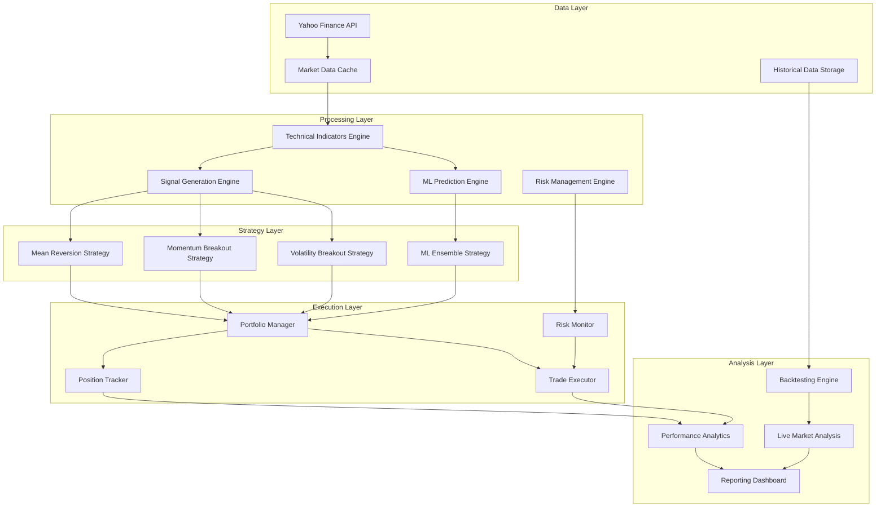
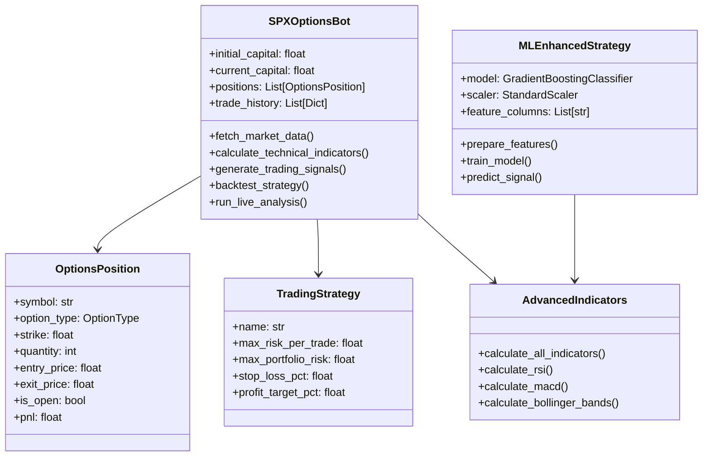
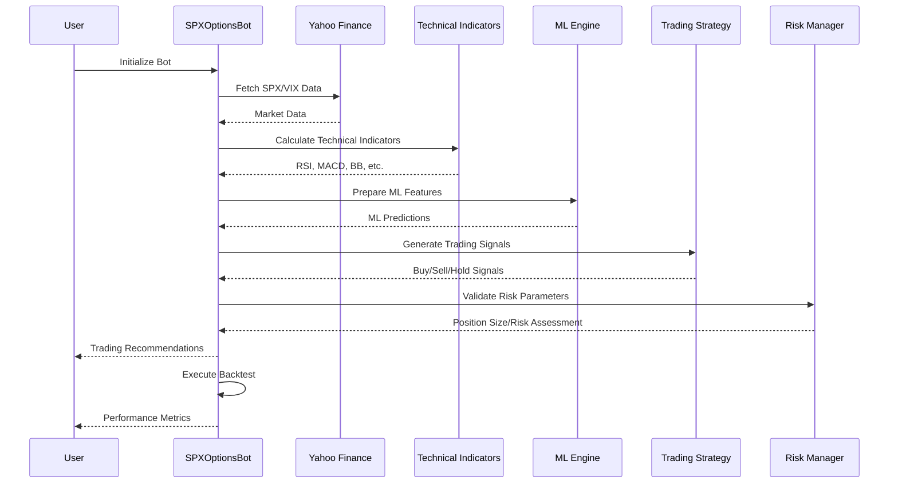

# 🚀 SPX Options Trading Bot

[](https://github.com/olaitanojo/Spx-options-trading-bot/actions/workflows/ci-cd-pipeline.yml)
[](https://www.python.org/downloads/)
[](https://opensource.org/licenses/MIT)
[](https://github.com/psf/black)

A sophisticated automated trading system for SPX options with comprehensive backtesting, risk management, and real-time execution capabilities. Features advanced technical analysis, machine learning predictions, and enterprise-grade CI/CD pipeline.

## 📋 Table of Contents
- [🏗️ Architecture](#%EF%B8%8F-architecture)
- [🎯 Features](#-features)
- [🛠️ Installation](#%EF%B8%8F-installation)
- [📊 How It Works](#-how-it-works)
- [🔧 Configuration](#-configuration)
- [📈 Sample Output](#-sample-output)
- [🔍 Key Components](#-key-components)
- [🚀 Deployment](#-deployment)
- [🧪 Testing](#-testing)
- [⚠️ Risk Disclaimer](#%EF%B8%8F-risk-disclaimer)
- [📝 License](#-license)
- [🤝 Contributing](#-contributing)

## 🏗️ Architecture

### System Overview


### Component Architecture


### Data Flow Architecture


🔧 **Enterprise-Grade CI/CD Pipeline Active** - This repository now includes automated testing, security scanning, code quality checks, and deployment capabilities!

## 🎯 Features

### 📊 Core Trading Features

- **📊 Advanced Technical Analysis**: 20+ indicators including MACD, RSI, Bollinger Bands, ATR, ADX, Stochastic, Williams %R
- **🤖 Machine Learning Integration**: Gradient Boosting Classifier with ensemble predictions
- **🔄 Multi-Strategy Framework**: Mean reversion, momentum breakout, volatility breakout, and ML ensemble strategies
- **⚡ Real-time Market Analysis**: Live SPX and VIX data integration with real-time signal generation
- **📈 Comprehensive Backtesting**: Historical strategy performance analysis with detailed metrics
- **🛡️ Advanced Risk Management**: Position sizing, stop-loss, portfolio risk controls, and volatility-based adjustments
- **📱 Live Trading Recommendations**: Current market analysis with confidence scores and reasoning
- **📋 Detailed Logging**: Complete audit trail of all trading decisions and system events

### 🚀 Advanced Features
- **🎯 Multi-timeframe Analysis**: Support for different timeframes and lookback periods
- **📊 Feature Engineering**: Advanced feature creation including lagged variables and ratios
- **🔍 Model Interpretability**: Feature importance analysis for ML predictions
- **⚙️ Configurable Parameters**: Easily adjustable risk and strategy parameters
- **🧪 A/B Testing Framework**: Compare different strategies and parameters
- **📈 Performance Analytics**: Detailed performance metrics including Sharpe ratio, max drawdown

### 🏗️ Infrastructure Features
- **🔄 CI/CD Pipeline**: Automated testing, code quality checks, and deployment
- **🐳 Docker Support**: Containerized deployment with Docker and docker-compose
- **☁️ Cloud Deployment**: Ready for deployment on AWS, GCP, or Azure
- **📊 Monitoring**: Comprehensive logging and monitoring capabilities
- **🔐 Security**: Security scanning and best practices implementation

## 🛠️ Installation

1. **Clone the repository**
   ```bash
   git clone https://github.com/olaitanojo/spx-options-trading-bot.git
   cd spx-options-trading-bot
   ```

2. **Install dependencies**
   ```bash
   pip install -r requirements.txt
   ```

3. **Run the bot**
   ```bash
   python main.py
   ```

## 📊 How It Works

### Technical Analysis Framework

The system employs a comprehensive technical analysis framework with 20+ indicators:

#### Price-Based Indicators
- **Moving Averages**: 10, 20, 50, 200-day SMA and 12, 26, 50-day EMA
- **Price Ratios**: Current price vs moving averages for trend strength

#### Momentum Indicators
- **MACD**: 12/26 EMA with 9-day signal line and histogram
- **RSI**: 14 and 21-period for multiple timeframe analysis
- **Stochastic Oscillator**: %K and %D for momentum confirmation
- **Williams %R**: Alternative momentum indicator
- **Rate of Change**: Price momentum over 10 periods

#### Volatility Indicators
- **Bollinger Bands**: 20-period with 2 standard deviations
- **Average True Range (ATR)**: For volatility measurement
- **Bollinger Band Width**: Volatility expansion/contraction
- **Historical Volatility**: 20-period rolling volatility

#### Trend Indicators
- **Average Directional Index (ADX)**: Trend strength measurement
- **Plus/Minus Directional Indicator**: Trend direction
- **Parabolic SAR**: Stop and reverse levels

#### Volume Indicators
- **Money Flow Index (MFI)**: Volume-weighted RSI
- **On-Balance Volume (OBV)**: Volume flow analysis
- **Volume Ratio**: Current vs average volume

#### Market Sentiment
- **VIX Integration**: Market fear gauge for volatility assessment
- **Commodity Channel Index (CCI)**: Cyclical turning points

### Multi-Strategy Approach

The system implements four distinct strategies that can work independently or in ensemble:

#### 1. Mean Reversion Strategy
**Bullish Signals**:
- RSI < 30 (oversold)
- Bollinger Band position < 0.05 (near lower band)
- Williams %R < -80
- Volume spike (>1.5x average)
- Low volatility environment

**Bearish Signals**:
- RSI > 70 (overbought)
- Bollinger Band position > 0.95 (near upper band)
- Williams %R > -20
- Volume spike confirmation

#### 2. Momentum Breakout Strategy
**Bullish Conditions**:
- Price above 20-day MA
- 20-day MA above 50-day MA (uptrend)
- ADX > 25 (strong trend)
- +DI > -DI (bullish directional movement)
- MACD above signal line
- Volume confirmation (>1.2x average)

**Bearish Conditions**:
- Price below 20-day MA
- 20-day MA below 50-day MA (downtrend)
- ADX > 25 (strong trend)
- +DI < -DI (bearish directional movement)
- MACD below signal line
- Volume confirmation

#### 3. Volatility Breakout Strategy
**Triggers**:
- Price breaks above/below Bollinger Bands
- ATR below 20-period average (low volatility setup)
- Bollinger Band width expansion
- Volume breakout (>1.5x average)
- RSI not in extreme territory

#### 4. ML Ensemble Strategy
**Features Used** (29 total):
- All technical indicators listed above
- Price ratios and normalized values
- Lagged features (1-2 periods)
- Volatility measurements

**Model**: Gradient Boosting Classifier
- Predicts future returns (>0.5% = Buy, <-0.5% = Sell)
- Features scaled using StandardScaler
- Model provides probability scores and feature importance

### Risk Management

- **Position Sizing**: 2% risk per trade
- **Portfolio Risk**: Maximum 10% total portfolio risk
- **Stop Loss**: 50% of option premium
- **Profit Target**: 25% gain target

## 🔧 Configuration

Key parameters can be adjusted in the `TradingStrategy` class:

```python
@dataclass
class TradingStrategy:
    name: str
    max_risk_per_trade: float = 0.02  # 2% of portfolio
    max_portfolio_risk: float = 0.10   # 10% total portfolio risk
    stop_loss_pct: float = 0.50        # 50% stop loss
    profit_target_pct: float = 0.25    # 25% profit target
```

## 📈 Sample Output

```
==================================================
LIVE MARKET ANALYSIS
==================================================
Current SPX Price: $4,567.89
Trading Signal: BUY
RSI: 45.23
MACD: 12.45
VIX Level: 18.76
Price vs 20-day MA: 2.34%

Recommendation:
Consider buying call options | Low VIX suggests low volatility - consider longer-term trades

==================================================
BACKTEST RESULTS (Last 90 Days)
==================================================
Total Trades: 15
Win Rate: 67%
Total P&L: $8,450.00
Return: 8.45%
Final Capital: $108,450.00
```

## 🔍 Key Components

### Core Classes

#### `SPXOptionsBot` Class
- **Primary Controller**: Orchestrates all trading operations
- **Data Management**: Fetches and processes market data from Yahoo Finance
- **Signal Generation**: Coordinates technical analysis and ML predictions
- **Backtesting Engine**: Historical performance analysis with detailed metrics
- **Live Analysis**: Real-time market evaluation and trade recommendations
- **Risk Management**: Position sizing and portfolio risk monitoring

#### `OptionsPosition` Class
- **Position Tracking**: Manages individual options positions
- **P&L Calculation**: Real-time profit/loss tracking
- **Trade Management**: Entry/exit price and date tracking
- **Status Monitoring**: Open/closed position status

#### `TradingStrategy` Class
- **Risk Parameters**: Configurable risk management settings
- **Strategy Configuration**: Adjustable trading parameters
- **Position Sizing**: Risk-based position size calculations

### Advanced Components

#### `MLEnhancedStrategy` Class
- **Machine Learning Engine**: Gradient boosting classifier for predictions
- **Feature Engineering**: Advanced feature creation and selection
- **Model Training**: Automated model training with cross-validation
- **Prediction Engine**: Real-time signal generation with confidence scores
- **Model Interpretation**: Feature importance analysis

#### `AdvancedIndicators` Class
- **Technical Analysis**: 20+ technical indicators using TA-Lib
- **Signal Processing**: Advanced signal smoothing and filtering
- **Multi-timeframe**: Support for different analysis periods
- **Custom Indicators**: Proprietary indicator calculations

#### `AdvancedTradingStrategies` Class
- **Strategy Collection**: Multiple trading strategy implementations
- **Ensemble Methods**: Strategy combination and voting systems
- **Strategy Evaluation**: Performance comparison and selection
- **Signal Aggregation**: Multi-strategy signal consolidation

### Supporting Modules

#### Enums and Data Classes
- `OptionType`: CALL/PUT enumeration
- `TradeSignal`: BUY/SELL/HOLD signal types
- `MLPrediction`: ML prediction results with metadata

#### Utility Functions
- **Data Validation**: Input data quality checks
- **Performance Metrics**: Advanced performance calculations
- **Logging System**: Comprehensive audit trail

## 🚀 Deployment

### Docker Deployment
```bash
# Build and run with Docker Compose
docker-compose up --build

# Or build manually
docker build -t spx-options-bot .
docker run -p 8000:8000 spx-options-bot
```

### Cloud Deployment
The application supports deployment on major cloud platforms:
- **AWS**: ECS, Lambda, or EC2
- **GCP**: Cloud Run, Compute Engine
- **Azure**: Container Instances, App Service

### Environment Variables
```bash
# Optional API keys for enhanced data sources
ALPHA_VANTAGE_API_KEY=your_key_here
TWELVE_DATA_API_KEY=your_key_here

# Logging configuration
LOG_LEVEL=INFO
LOG_FORMAT=json
```

## 🧪 Testing

### Running Tests
```bash
# Run all tests
pytest

# Run with coverage
pytest --cov=src --cov-report=html

# Run specific test categories
pytest tests/unit/          # Unit tests
pytest tests/integration/   # Integration tests
pytest tests/performance/   # Performance tests
```

### Test Categories
- **Unit Tests**: Individual component testing
- **Integration Tests**: End-to-end workflow testing
- **Performance Tests**: Strategy performance validation
- **ML Model Tests**: Model accuracy and feature importance validation

### Code Quality
```bash
# Code formatting
black src/ tests/

# Linting
flake8 src/ tests/

# Type checking
mypy src/

# Security scanning
bandit -r src/
```

## 📊 Performance Metrics

### Key Performance Indicators
- **Win Rate**: Percentage of profitable trades
- **Total Return**: Overall portfolio return percentage
- **Sharpe Ratio**: Risk-adjusted return measure
- **Maximum Drawdown**: Largest peak-to-trough decline
- **Average Trade Duration**: Typical holding period
- **Profit Factor**: Ratio of gross profit to gross loss

### Risk Metrics
- **Value at Risk (VaR)**: Potential loss estimation
- **Expected Shortfall**: Average loss beyond VaR
- **Beta**: Market correlation coefficient
- **Volatility**: Standard deviation of returns

## ⚠️ Risk Disclaimer

This software is for educational and research purposes only. Trading options involves substantial risk and is not suitable for all investors. Past performance does not guarantee future results. Always consult with a qualified financial advisor before making investment decisions.

## 📝 License

MIT License - see LICENSE file for details.

## 🤝 Contributing

Contributions are welcome! Please feel free to submit a Pull Request.

## 📧 Contact

Created by [olaitanojo](https://github.com/olaitanojo)

---

⭐ **Star this repository if you find it helpful!**
